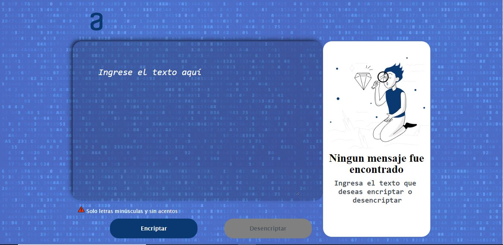

# Challengue_1_Encriptador_de_texto
Encriptador y desenciptador de texto con llave de encriptación especifica.
Hecho en html, css y javascript, aprendido de los cursos de Aluralatam del programa Oracle Next Education.

:jigsaw: **Función:**
Encripta y desencripta el texto introducido por el usuario.

:key: **Llave de encriptación:**
- "a" --> "ai"
- "e" --> "enter"
- "i" --> "imes"
- "o" --> "ober"
- "u" --> "ufat"

:rotating_light: **NOTA:** el programa no deja introducir números, caracteres especiales y acentos, si un usuario ingresa letras mayúsculas automáticamente el programa las pasa a minúsculas.

